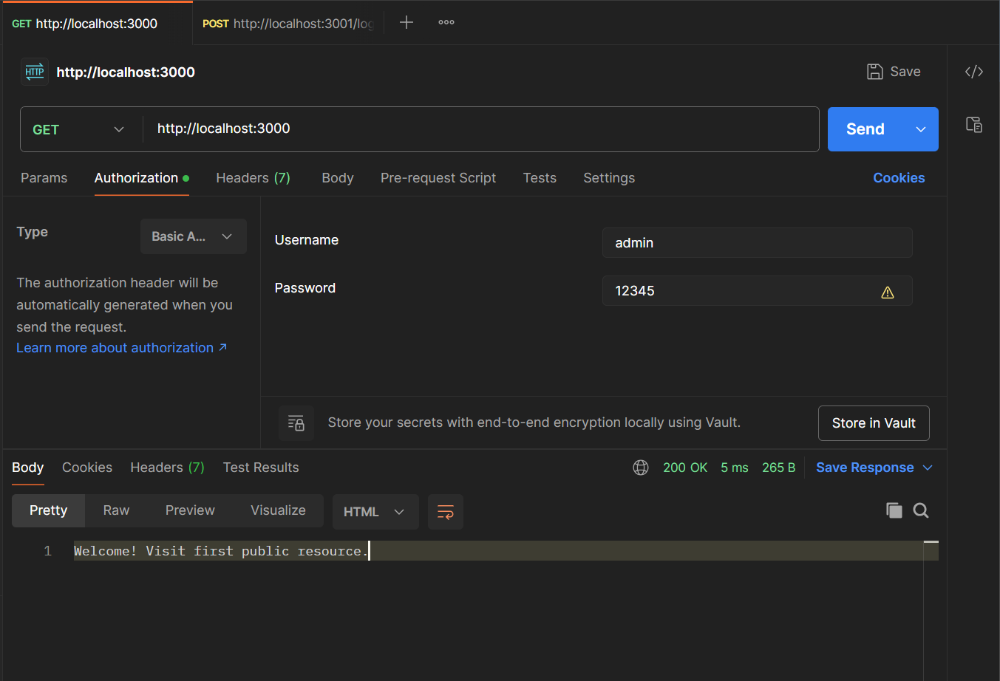
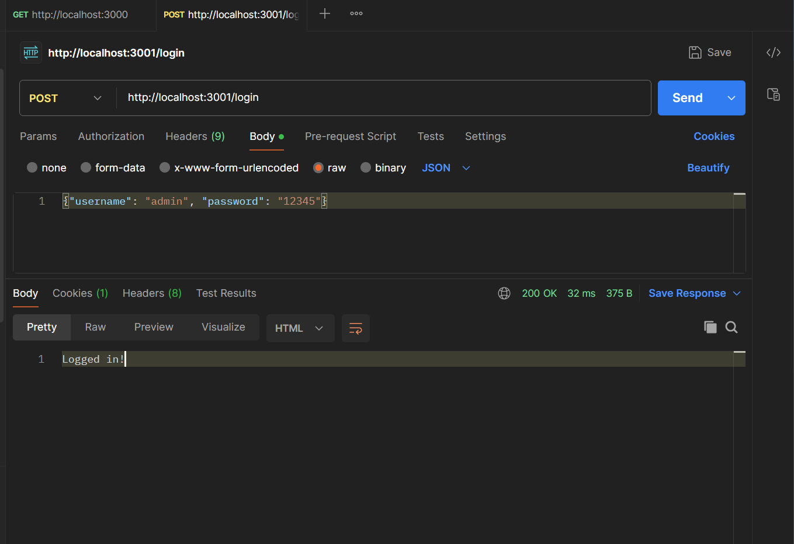
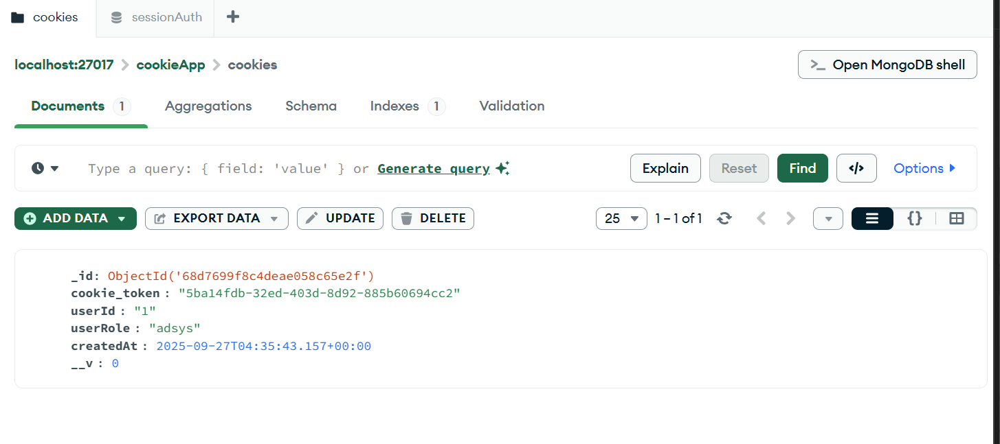
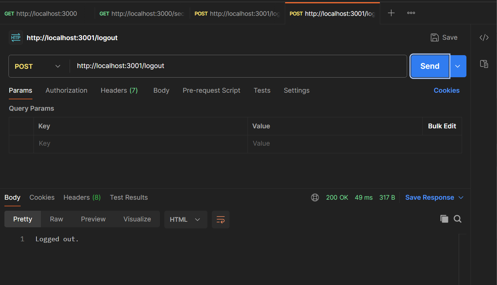

# Cookie Session Authentication Assignment

## Overview

This project demonstrates cookie-based session authentication using Node.js and Express.js. The assignment includes testing various authentication methods using POSTMAN.


### Run the Server

```bash
node app.js
```

The server will start on `http://localhost:3000`

## POSTMAN Testing

### 1. Basic Authentication Test

**GET Request with Basic Auth**



**Request Details:**

- Method: `GET`
- URL: `http://localhost:3000`
- Authorization: Basic Auth
  - Username: `admin`
  - Password: `12345`

### 2. node cookie_auth.js

**Login with Session**



**Request Details:**

- Method: `POST`
- URL: `http://localhost:3001/login`
- Headers: `Content-Type: application/json`
- Body (raw JSON):

```json
{
  "username": "admin",
  "password": "12345"
}
```

**Show cookie in mongoDB**



**Show cookie in mongoDB**


**Logout**



**Important:** Check the Cookies tab in POSTMAN to see the session cookie being set.


### Authentication Middleware

The project includes middleware to protect routes and manage user sessions effectively.


